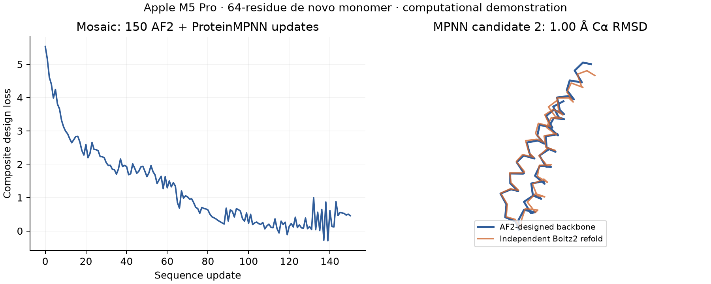

# Full Mosaic design experiment on Apple Silicon

The current adapter includes a corrected contact-loss backward pass and a
[48-residue binder / 76-residue ubiquitin experiment](ubiquitin/README.md).
The CPU/MPS numerical gate passes for that exact complex. The monomer results
below are historical trajectories from before the backward correction; they
remain available as evidence of the original experiment.

Two complete **64-residue de novo monomer** workflows ran on an M5 Pro:
random relaxed sequence → full AF2 confidence/structure objective → 150 Mosaic
optimization steps → hard-sequence backbone prediction → two ProteinMPNN
redesigns → independent, offline Boltz2 refolding → fixed numerical screening.
No native sequence, starting backbone, target, MSA search or template was used.

This advances beyond the released CLI's fixed-backbone design demonstration.
It is a small bespoke Mosaic workflow, **not a reproduction of an upstream
binder campaign**, a binding demonstration, or a production-validated backend.
The released `macfoldkit design` command remains unchanged.



## Results

The joint run's 150 optimization steps took **91.30 s**, with **97.36 s** total
inside the design script's measured region (imports and independent refolding
excluded). A warm full-gradient evaluation took **0.599 s**. Peak process RSS
was **1.46 GiB**; peak reported backend allocation was **1.48 GiB**. These measures
overlap and are not total system memory. Hardware: M5 Pro, 20 GPU cores, 18 CPU
cores, 24 GiB unified memory, macOS 26.6.2.

| Joint-run sequence | Boltz2 pLDDT /100 | pTM | C-alpha RMSD to designed backbone | Example screen |
|---|---:|---:|---:|---|
| Direct hard sequence | 94.24 | 0.846 | 2.605 Å | Fail |
| ProteinMPNN candidate 1 | 96.10 | 0.874 | 0.652 Å | Pass |
| ProteinMPNN candidate 2 | 95.49 | 0.817 | 0.996 Å | Pass |

The screen was declared before refolding: pLDDT ≥80, pTM ≥0.6 and RMSD ≤2 Å,
using every C-alpha by residue position and a proper rotation. These are only
simple self-consistency checks. Candidate 1 is 65.6% alanine; candidate 2 is
strongly enriched in glutamate and lysine. Expression, solubility, stability,
novelty, function and binding were not established. **Do not interpret the pass
column as an experimentally useful design or permission to omit other filters.**

The baseline omitted joint MPNN guidance and ran 150 steps in 79.25 s. Its
MPNN candidate 1 passed the same screen (pLDDT 82.92, pTM 0.614, RMSD 1.449 Å)
but was also alanine-rich. Every candidate from both trajectories was evaluated;
failed candidates remain in the [baseline](results/baseline-refolding.json) and
[joint](results/joint-refolding.json) reports. This is two trajectories with one
initialization seed, not a design success-rate benchmark.

## Numerical status: contact-gradient defect isolated

Full structure/confidence gradients are materially different from the earlier
distogram-only probe. CPU and MPS forward objective values agreed within 1.5e-6,
but full raw gradients differed by **3.24% relative L2 at 32 residues**, **3.00%
at 64 residues**, and **2.95% for the joint 64-residue objective**. Gradient
cosines were approximately 0.99975. These failed the original 0.5% relative-L2
gate. See the [historical comparisons](results/gradient-parity.json).

The defect is now isolated: the tested MPS backend drops the first row's
cotangents in a descending-sort contact reduction. The experiment-local
`metal_losses.py` keeps the forward equation and selected tie subgradient while
avoiding that scatter in reverse mode. Its analytical regression passes all
40 cases on CPU and MPS; the original fails 20/40 MPS cases. Complete corrected
contact-loss gradients agree with CPU to relative L2 below 4.5e-7. See the
[reproducer and source analysis](SCATTER_BACKWARD_BUG.md).

The corrected **joint 64-residue** raw gradient differs by **0.149%**, with
**0.163%** error after simplex-tangent projection. The **124-residue complex**
differs by **0.0479%** raw / **0.0494%** tangent. Both pass the unchanged 0.5%
gate; scalar losses differ by 1.43e-6 and zero respectively. The corrected CPU
monomer loss and gradient match the original CPU result exactly. Residual GPU
differences remain; this does not establish parity for arbitrary Mosaic models,
inputs, losses, multi-recycle gradients, or forward-mode differentiation.
The earlier trajectory artifacts are not retroactively validated by the fix.
Saved evidence: [monomer](results/corrected-monomer-parity.json),
[complex](results/corrected-complex-parity.json),
[analytic CPU](results/contact-regression-cpu.json),
[analytic MPS](results/contact-regression-mps.json), and
[complete contact losses](results/contact-loss-parity.json).

Every optimization evaluation checked the raw loss and gradient for finiteness
before Mosaic's usual `nan_to_num` handling. The wrapper saves the actual best
evaluated sequence and loss together, including a final reevaluation. The final
portable launcher also verified the actual gradient array was on `MPS:0`.
The comparison script also checks identical initialization, features and settings.

Mosaic uses a hard-PSSM straight-through estimator; the ProteinMPNN recovery
term stops gradients through sampled sequences. This run differentiates the
AF2 structure/confidence path and recovery surrogate, not discrete MPNN sampling.
Naive finite differences of the hard forward path are not a valid check of
that intentional surrogate gradient.

## Mac adaptation

The single-checkpoint loader and direct one-pass wrapper are adapted from
[Mosaic's MIT-licensed AF2 wrapper](https://github.com/escalante-bio/mosaic/blob/b94b9d4eb9907a700a6d78ed2d29d3704c5df46c/src/mosaic/models/af2.py).
The model equations and upstream optimizer are retained, with the contact VJP
workaround above. Only model 1 Multimer-v3 is loaded; inputs have one MSA row,
FP32, rematerialization and one forward pass. Optional binder mode adds one fixed
target sequence and target template. No custom forward-only Metal
attention kernels are used.

Upstream's single-iteration recycle `lax.scan` stalled for over four minutes in
JAX-MPS execution. The equivalent direct call finished its first 32-residue
full gradient in 11.40 s and subsequent calls in 0.219 s. CPU losses and gradients
for the scan and direct forms were identical in this test. The workaround is
strictly limited to one pass; it does not implement or validate multi-recycle
backpropagation. Nested MLX compilation is a plausible explanation from source
inspection, not a proven root cause.

The joint objective is:

- PLDDT loss + 0.05 × within-chain PAE;
- within-chain contact loss (8 contacts per residue);
- 0.1 × distogram radius + 0.3 × helix loss;
- 5 × ProteinMPNN sequence recovery, 4 samples, temperature 0.1.

The baseline omits the final term. Optimization uses `simplex_APGM`, step size
0.2, zero momentum and 150 steps. Initial sequence seed is 7; the objective RNG
is fixed at 7 even when the initialization seed is changed. Post-design MPNN
uses two keys, 107 and 108, temperature 0.1, and ten upstream Jacobi iterations.
This is approximate Jacobi redesign, not an autoregressive sampler.

## Reproduce from a source checkout

Use the existing MacFoldKit setup. AF2 weights are needed in addition to the
Mosaic environment; these commands fetch multimer parameters explicitly:

```bash
macfoldkit setup mosaic
macfoldkit setup colabfold
macfoldkit fetch colabfold --model-type alphafold2_multimer_v3
macfoldkit setup boltz
macfoldkit fetch boltz

bash experiments/mosaic_af2/run.sh mps design-results \
  --length 64 --steps 150 --seed 7 --mpnn-weight 5 --mpnn-samples 4

for candidate in hallucinated mpnn_1 mpnn_2; do
  macfoldkit fold "design-results/${candidate}.yaml" "refolds/${candidate}" \
    --backend boltz -- --offline
done

"${MACFOLDKIT_HOME:-$HOME/Library/Caches/macfoldkit}/runtimes/mosaic/bin/python" \
  experiments/mosaic_af2/evaluate_refolds.py design-results refolds validation.json
```

Use a new output directory for each design run. Set `MACFOLDKIT_HOME` consistently
if using a custom cache. `run.sh cpu ... --probe-only` supplies a CPU gradient
reference; use matching length, seed and MPNN options. The scripts are available
in this source checkout, not installed as commands in alpha 0.1.0a1.

Recorded [design summaries](results/joint-design.json), [trajectory](results/joint-trajectory.json),
[FASTA 1](results/joint-mpnn_1.fasta), [FASTA 2](results/joint-mpnn_2.fasta),
[designed backbone](results/joint-backbone.pdb) and independent Boltz CIFs are
included. The optional plot script requires NumPy, Gemmi and Matplotlib.
Source and dependency pins are the same as alpha 0.1.0a1. The standard 29 package
tests still pass; they are separate from these locally measured GPU experiments.
