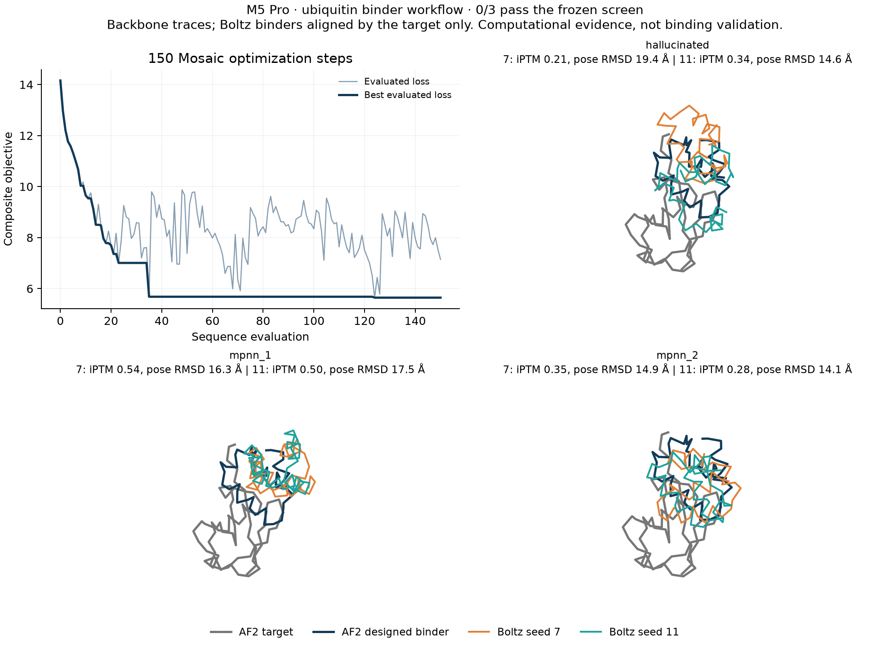

# Ubiquitin binder workflow on Apple Silicon

This is a bounded computational demonstration: a 48-residue designed chain
against complete 76-residue ubiquitin (public PDB 1UBQ). It uses full Mosaic AF2
structure/confidence gradients, a fixed target sequence and template, binder-only
ProteinMPNN redesign, and independent offline Boltz2 complex predictions.
It does not establish binding, affinity, specificity, expression or stability.

> **Follow-up:** [`v2/`](v2/README.md) repeats this experiment changing exactly one
> variable — the optimization schedule — against the same target, seed, losses and a
> byte-identical screen. It eliminates the relaxed-to-hard gap measured here
> (2.435 -> 0.000) and improves fold and pose reproducibility substantially, but also
> returns 0/3. This v1 run is preserved unchanged.
> A later [v3 campaign](v3/README.md) shows this run and v2 were each a single draw:
> across a pre-registered 3-seed set, seed-to-seed spread exceeds every protocol effect
> measured, and 3 of 18 candidates passed the same screen.

## Recorded outcome

**The complete workflow executed; 0/3 candidates passed the frozen screen.**
All six independent Boltz predictions completed, with no missing-data or
provenance errors. The rejection was a scientific result, not a runtime failure.
This one trajectory is not a design success-rate benchmark.



| Candidate | Boltz seed | Binder pLDDT /100 | iPTM | Binder fold RMSD | Target-aligned binder RMSD | Screen |
|---|---:|---:|---:|---:|---:|---|
| Direct hard sequence | 7 | 66.41 | 0.211 | 3.88 Å | 19.37 Å | Fail |
| Direct hard sequence | 11 | 64.68 | 0.342 | 4.25 Å | 14.63 Å | Fail |
| MPNN 1 | 7 | 61.83 | 0.538 | 3.31 Å | 16.32 Å | Fail |
| MPNN 1 | 11 | 66.67 | 0.499 | 1.81 Å | 17.52 Å | Fail |
| MPNN 2 | 7 | 56.21 | 0.354 | 5.02 Å | 14.92 Å | Fail |
| MPNN 2 | 11 | 60.28 | 0.281 | 10.59 Å | 14.06 Å | Fail |

Every refold failed binder confidence, interface confidence and docking-pose
consistency. MPNN 1 / seed 11 preserved the binder's own fold within 2 Å but
disagreed strongly on placement, illustrating why target-only alignment matters.
Composition, contact-count and clash filters passed for all six Boltz outputs.

The soft objective improved from 14.16 to 5.65, with substantial later
oscillation. Discretizing the best relaxed sequence raised the objective to
8.08; its AF2 binder pLDDT was 51.44 and iPTM 0.139. AF2 cross-PAE means were
21.37/16.39 Å. Its target remained close to input (0.35 Å RMSD), while the
designed interface contained two heavy-atom clashes below 1.5 Å. These outcomes
point to design-protocol quality and relaxed-to-hard consistency as remaining
work; numerical portability alone does not establish a useful binder.

On the M5 Pro (20 GPU cores, 24 GiB unified memory, macOS 26.6.2), optimization
took **325.64 s** and the design script's measured region took **335.66 s**,
including model loading, gradient compilation, export and two MPNN redesigns.
Imports and independent refolding are excluded. Warm full-gradient time was
2.31 s. The six Boltz model calls took **27.92 s total**, individually 4.25–6.56 s;
preprocessing, loading and separate-process startup are excluded from those calls.

Peak process RSS was 1.48 GiB, peak live backend allocation 2.48 GiB, and the
backend reported a 6.82 GiB allocator pool at the end. These measurements overlap
and have different meanings; they are not additive and do not establish peak
whole-system memory use.

All scores and failures are in [validation.json](validation.json), with the
[design summary](design/summary.json), [trajectory](design/trajectory.json),
[AF2 complex](design/hallucinated.pdb), candidate FASTAs/YAMLs and six refold CIFs
under `design/` and `refolds/`. The published hard-output NPZ retains the
confidence, chain/sequence and coordinate arrays used by the evaluator, omitting
large logits. Prediction-report absolute workspace prefixes are normalized to
`${WORKSPACE}`; [artifact-provenance.json](artifact-provenance.json) records both
original and normalized hashes. Scientific values and CIF bytes are unchanged.

## Frozen protocol and numerical gate

[protocol.json](protocol.json) was written before inference; its SHA-256 is
`89d1435646013dbc8507ef085554a8cbd8073525cdbd5a76c070f4440aeb60bd`.
The [target](ubiquitin-target.cif) removes water/alternative conformations from
the existing public 1UBQ example, retaining the complete protein coordinates.
The [manifest](target-manifest.json) records its digest and sequence.

The target is a template condition, not a rigid coordinate constraint. Feature
checks verify all 304 target N/CA/C/O atoms, no binder template, and preservation
of the target sequence through binder replacement. The raw AF2 asym IDs are
1/2; the adapter normalizes exported chains to A=binder and B=target, with
1-based residue numbering. The preflight's B/C labels describe the upstream
writer before this normalization.

The exact templated 124-residue input passed the original 0.5% CPU/MPS gradient
gate: **0.0479% raw relative L2**, **0.0494% simplex-tangent relative L2**, and
identical initial scalar loss. See [numerical evidence](../results/corrected-complex-parity.json).
The contact-backward workaround and its analytical regressions are described
[here](../SCATTER_BACKWARD_BUG.md). This is reverse-mode validation; Mosaic's
hard-PSSM straight-through estimator makes naive finite differences of the hard
forward function unsuitable for validating its intentional surrogate gradient.

## Design and independent checks

One NumPy initialization (seed 7), 150 `simplex_APGM` steps, step size 0.2 and
zero momentum. One FP32 AF2 Multimer-v3 model/pass, one sequence row, dropout
off, objective key 7. The objective includes binder pLDDT/contact/PAE, radius
and helix terms, 8 Å binder-target contacts, both cross-PAE directions, iPTM,
and ProteinMPNN sequence recovery. Exact weights are in the protocol.

The lowest evaluated finite objective supplies the hard sequence and AF2
complex. Two MPNN redesigns (keys 107/108, ten Jacobi iterations, temperature
0.1) condition on the whole predicted complex and change only the binder.
All three candidates receive two Boltz predictions (seeds 7/11), each with
empty MSAs, no template/restraints, balanced settings and FP32 pair precision.
No sequences are uploaded to an MSA service. No additional search seeds are
used to select a favorable example.

Every candidate must pass **both** independent refolds and every criterion:

- Binder pLDDT ≥80 and complex iPTM ≥0.65.
- Binder self-aligned Cα RMSD ≤2 Å, and binder RMSD after **target-only**
  alignment ≤3 Å, both relative to the designed AF2 complex.
- Target self-aligned RMSD to original 1UBQ ≤2 Å.
- At least eight contacting binder residues, eight target residues and 20
  interchain residue pairs, using heavy-atom distances <5 Å.
- No interchain heavy-atom distance <1.5 Å; complete finite coordinates and
  exact sequence/chain correspondence are required.
- Sequence entropy ≥2.5 bits, no amino acid >30%, no homopolymer longer than four.

These are heuristic computational filters, not a validated binding predictor.
The target-only alignment prevents a correct binder fold in an inconsistent
docking pose from passing. Boltz PAE matrices are not exported by this adapter;
cross-PAE is reported only as an AF2 diagnostic. The evaluator also reports
AF2 target distortion and separates soft-objective values from hard-sequence
confidence. Missing data fail the screen and every candidate is retained.

## Reproduce

From the repository root, with the backend environments and weights prepared
as in the [parent instructions](../README.md):

```bash
EXP=experiments/mosaic_af2
INPUT="$EXP/ubiquitin"
bash "$EXP/run.sh" cpu cpu-probe --length 48 --steps 150 --seed 7 \
  --mpnn-weight 5 --target "$INPUT/ubiquitin-target.cif" \
  --protocol "$INPUT/protocol.json" --probe-only
bash "$EXP/run.sh" mps mps-probe --length 48 --steps 150 --seed 7 \
  --mpnn-weight 5 --target "$INPUT/ubiquitin-target.cif" \
  --protocol "$INPUT/protocol.json" --probe-only

MODEL_HOME="${MACFOLDKIT_HOME:-$HOME/Library/Caches/macfoldkit}"
"$MODEL_HOME/runtimes/mosaic/bin/python" "$EXP/compare_gradients.py" \
  cpu-probe mps-probe gradient-parity.json
# Continue only if the gate passes.
bash "$EXP/run.sh" mps binder-design --length 48 --steps 150 --seed 7 \
  --mpnn-weight 5 --target "$INPUT/ubiquitin-target.cif" \
  --protocol "$INPUT/protocol.json"
for candidate in hallucinated mpnn_1 mpnn_2; do
  for seed in 7 11; do
    macfoldkit fold "binder-design/$candidate.yaml" "binder-refolds/$candidate" \
      --backend boltz -- --offline --profile balanced --precision float32 --seed "$seed"
  done
done
"$MODEL_HOME/runtimes/boltz/bin/python" "$EXP/evaluate_binder.py" \
  binder-design binder-refolds binder-validation.json \
  --protocol "$INPUT/protocol.json" --target "$INPUT/ubiquitin-target.cif"
```

Use new output directories. Check each command's exit status; the example loop
is a fixed six-prediction budget. The experiment is available in the source
checkout, not the alpha wheel or released `macfoldkit design` command.

The evaluator's CPU regressions cover rigid transforms, a displaced binder
that preserves its own fold, reflections, missing/nonfinite atoms, sequence
mismatches, absent confidence, provenance hashes and the two-seed requirement:

```bash
"$MODEL_HOME/runtimes/boltz/bin/python" -m unittest discover \
  -s experiments/mosaic_af2 -p test_evaluate_binder.py -v
```
